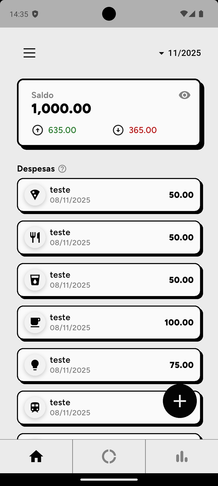
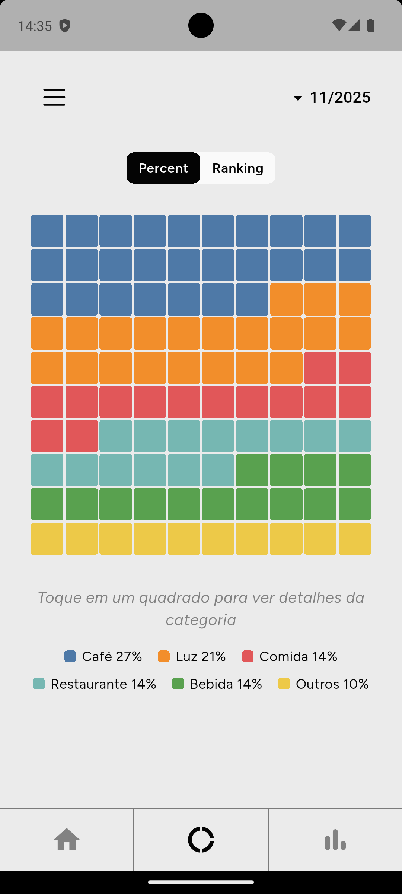

# 💰 Cashio – Expense Tracker

**Cashio** is a sleek, fast, and offline-first expense tracker built with **Flutter**, powered by the **Isar database**.  
Track your daily expenses, visualize spending trends, and take full control of your personal finances — all from your phone.

---

## 📱 Screenshots

<p float="left">
  
  
</p>

---

## 🚀 Features

- 🧾 **Add, edit, and delete** expenses easily
- 🗂️ **Categorize** spending (Food, Transport, etc.)
- 📊 **Beautiful charts** for yearly/monthly analysis
- 💾 **Offline-first** with local Isar database
- ⚡ **Fast performance**, even with thousands of entries

---

## 🛠️ Tech Stack

| Layer            | Technology                  |
| ---------------- | --------------------------- |
| Framework        | Flutter                     |
| Language         | Dart                        |
| Database         | Isar (NoSQL local database) |
| State Management | Provider                    |
| Charts           | fl_chart                    |

---

## ⚙️ Installation

```bash
# 1️⃣ Clone the repository
git clone https://github.com/vfb-dev/cashio.git
cd cashio

# 2️⃣ Get Flutter dependencies
flutter pub get

# 3️⃣ Run the app
flutter run
```

## Author

**vfb-dev** — Crafting awesome mobile apps
